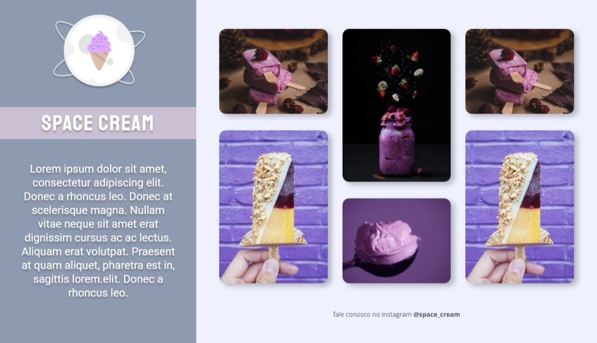

# Projeto 06 | Programa Explorer da Rocketseat

- Desafio: criar um layout responsivo (mobile e desktop)

[🔗 Clique aqui para acessar](https://alineviana.github.io/grid-animations/desafio/)

 

> ## 📝 Conceitos estudados
 

- Responsividade
- Mobile First
- Unidade de medida flexível
- Variáveis CSS
- Grid
- Animações e transições
- Media queries

 

> ## 🖥️ Tecnologias

 

- HTML5  
- CSS3

 

